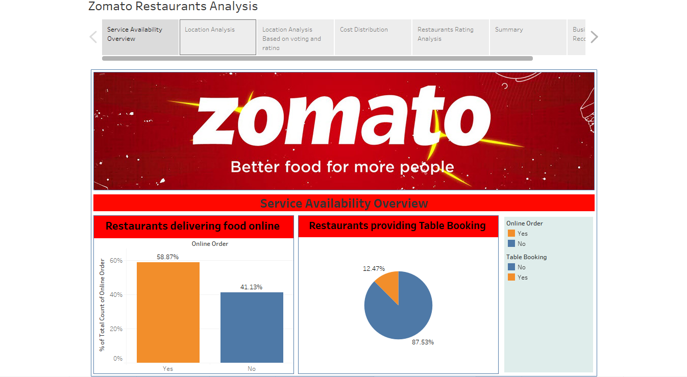
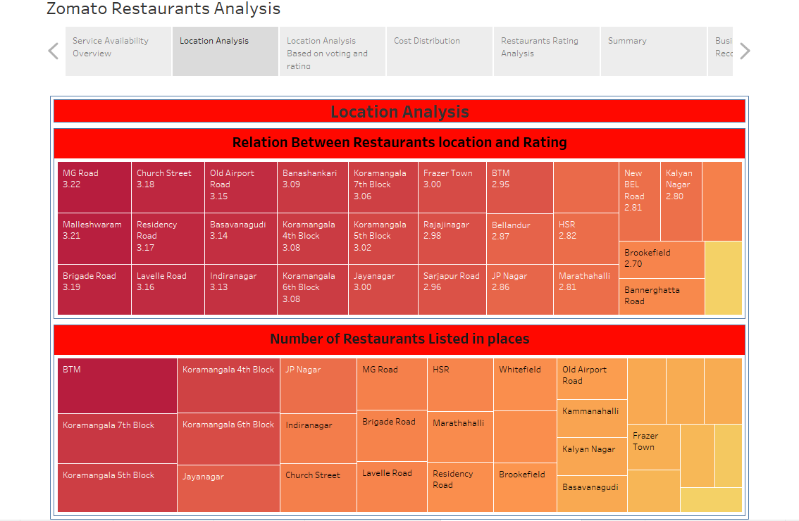
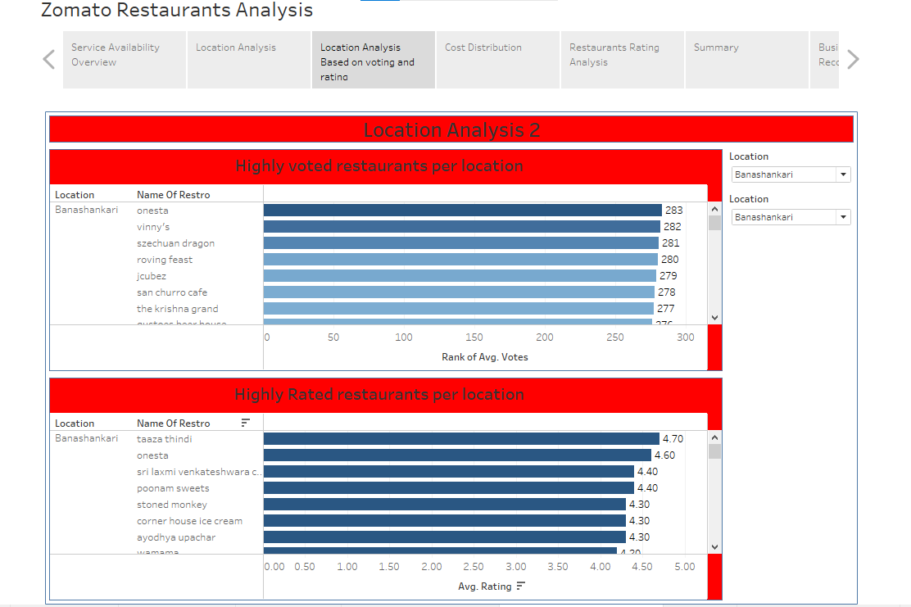
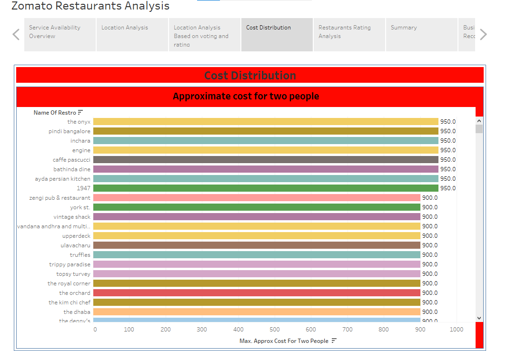
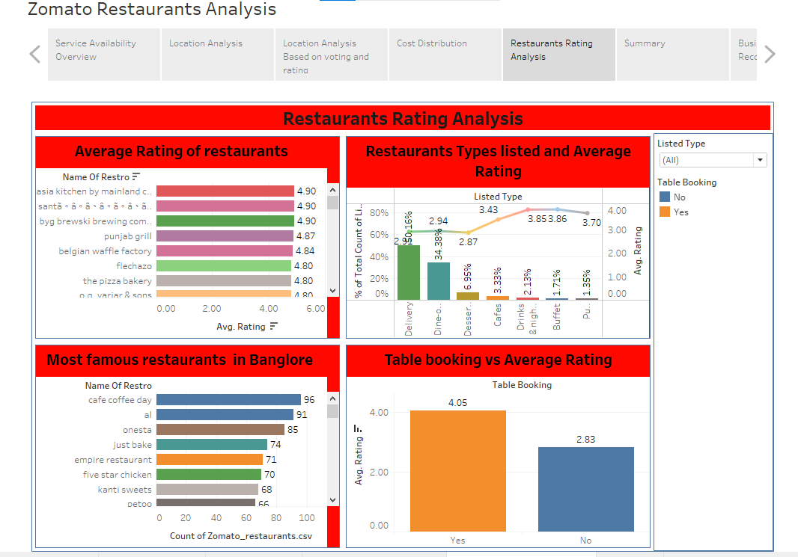
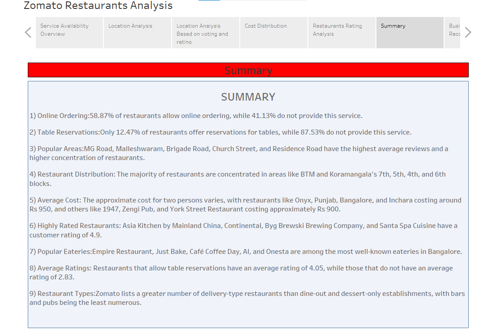
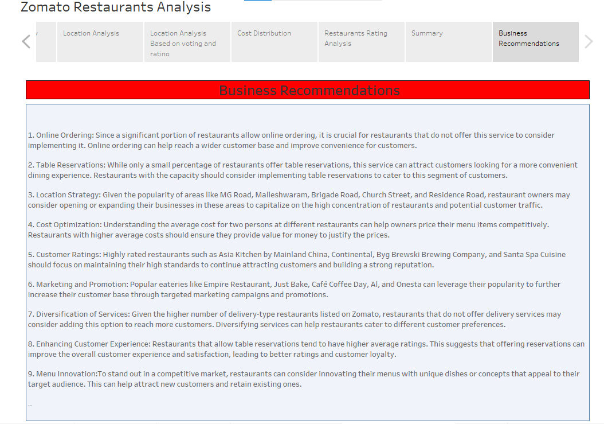

# Zomato Restaurants Analysis

## Project Description
This project involves analyzing a dataset of restaurants registered on Zomato in Bengaluru City to gain insights into the restaurant industry in the area. The goal is to explore various aspects of the dataset, such as ratings, types of cuisine, cost for two people, and more, to understand trends and patterns in the restaurant business.

## Dataset Information
The dataset contains more than 50,000 rows and 17 columns, including information about restaurants' names, locations, ratings, types of cuisine, cost for two people, and more. It is imported into a Pandas DataFrame for analysis.

## Data Cleaning
- Dropped redundant columns
- Renamed columns for clarity
- Handled missing values in the 'rating', 'restro_type', and 'approx_cost_for_two_people' columns

## Exploratory Data Analysis (EDA)
- Basic analysis of the dataset
- Checked for null values and duplicates
- Explored relationships between variables

## Data Visualization
Data visualization was performed using both Tableau and Python (Matplotlib, Seaborn) to gain insights from the dataset. [Click here to view the Tableau dashboard for visualizing the data.](https://public.tableau.com/app/profile/pavan.ambare7481/viz/zomatoDataset/ZomatoRestaurantsAnalysis?publish=yes)

## Insights
- Distribution of ratings
- Percentage of online orders
- Average rating by location
- Relationship between rating and average cost for two people

## Additional Insights

- **Popular Locations:** Identified the top locations with the highest number of restaurants.
- **Restaurant Types:** Explored the most common types of restaurants (e.g., cafes, bars, fine dining) in the dataset.
- **Service Types:** Visualized the percentage of each type of service offered by restaurants (e.g., buffet, delivery, dine-out).
- **Rating vs. Votes:** Analyzed the relationship between ratings and the number of votes received by restaurants.

## Conclusion
The analysis provides valuable insights into the restaurant industry in Bengaluru City. Based on the findings, recommendations can be made to improve the quality of service, increase customer satisfaction, and attract more customers.

## Data Export
The cleaned dataset was exported to a CSV file for further analysis and visualization in Tableau.

## Skills and Tools
- Python (NumPy, Pandas)
- Data Visualization (Matplotlib, Seaborn, Tableau)
- EDA techniques

## Future Work
Future work could include incorporating more datasets to enhance the analysis and refining the current analysis to uncover deeper insights into the restaurant industry.

## Contact Information
For collaboration or further discussion, feel free to reach out:
- Email: [pavanambare007@gmail.com]
- LinkedIn: [http://www.linkedin.com/in/pavan-ambare-542b961a3]

LINK : https://public.tableau.com/app/profile/pavan.ambare7481/viz/zomatoDataset/ZomatoRestaurantsAnalysis?publish=yes

